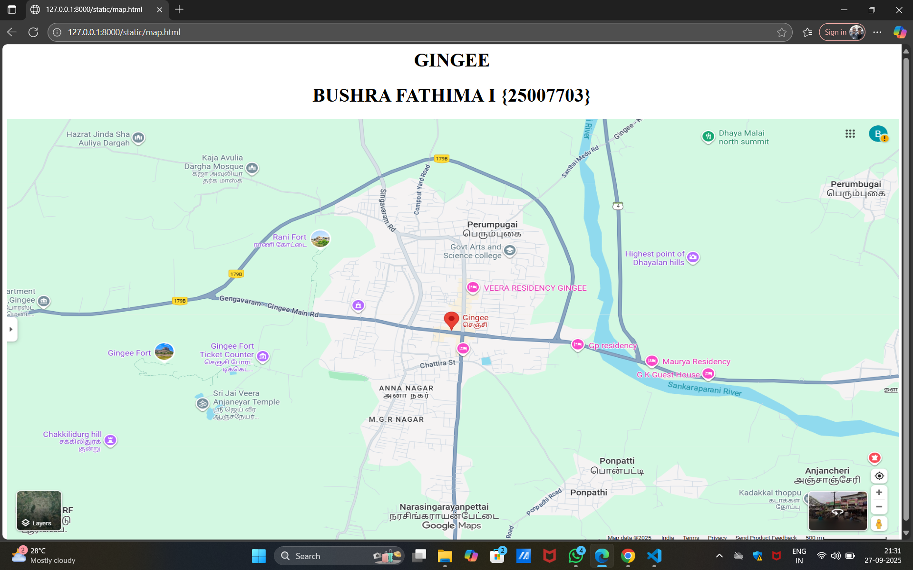
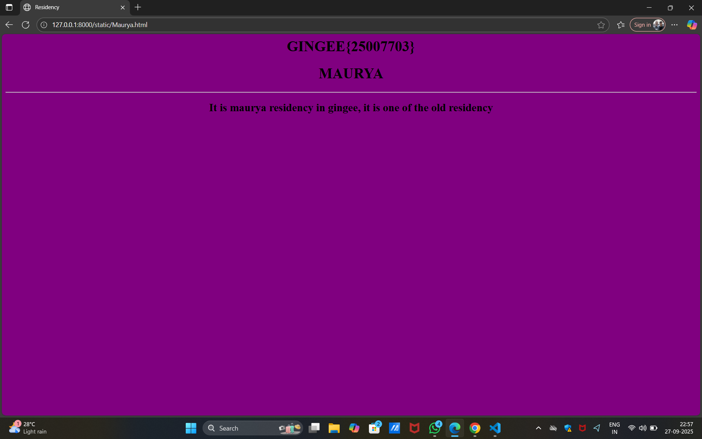
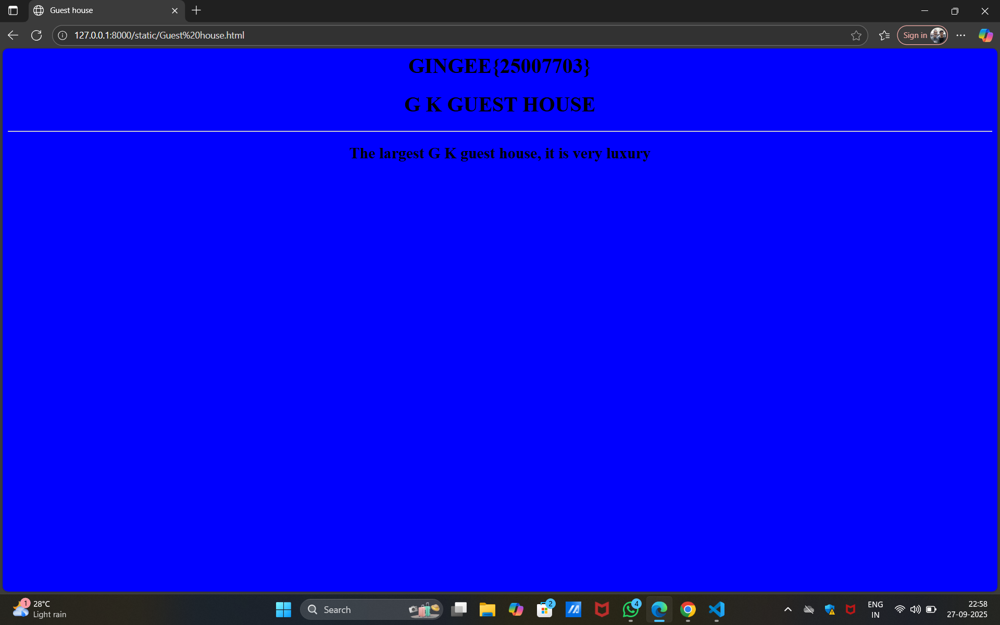
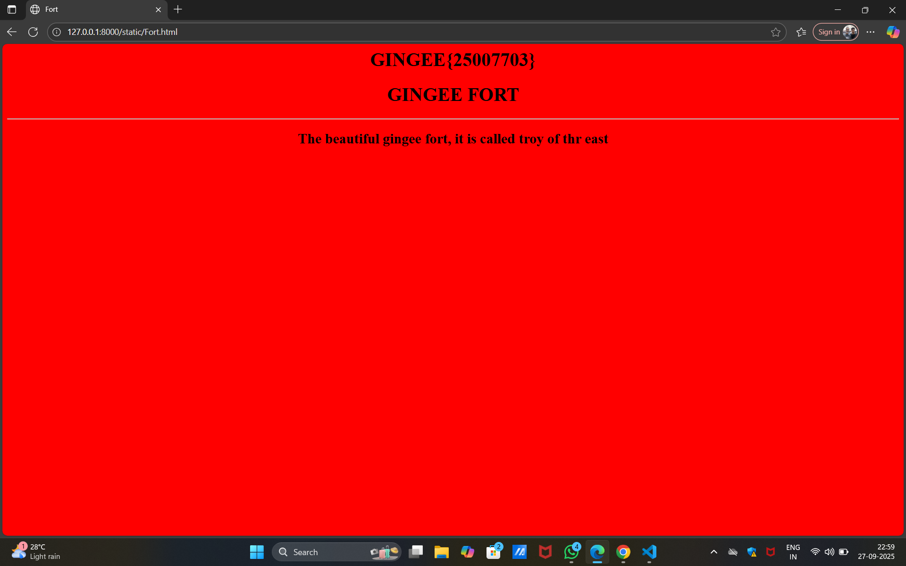
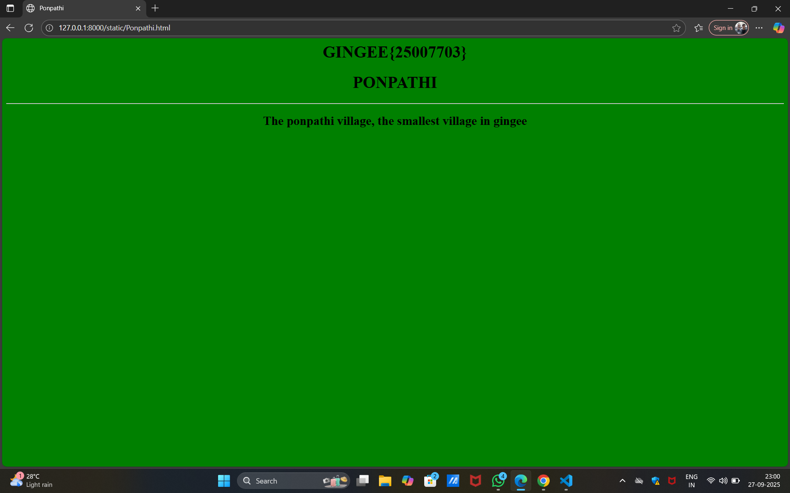
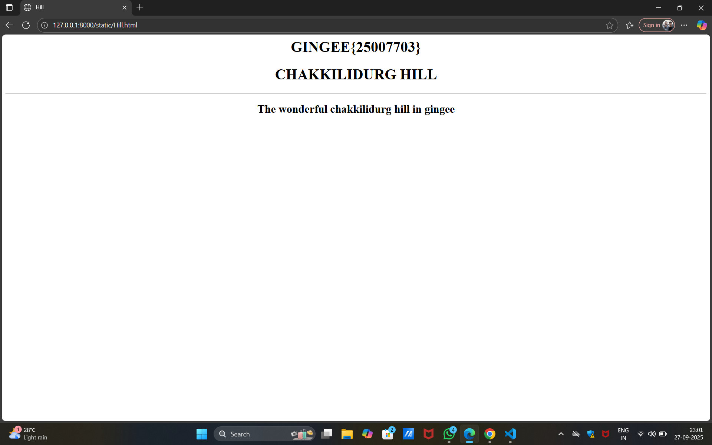

# Ex04 Places Around Me
## Date: 27.09.2025

## AIM
To develop a website to display details about the places around my house.

## DESIGN STEPS

### STEP 1
Create a Django admin interface.

### STEP 2
Download your city map from Google.

### STEP 3
Using ```<map>``` tag name the map.

### STEP 4
Create clickable regions in the image using ```<area>``` tag.

### STEP 5
Write HTML programs for all the regions identified.

### STEP 6
Execute the programs and publish them.

## CODE
```
map.html
<html>
    <head>
        <body align="center">
            <h1>GINGEE</h1>
            <h1>BUSHRA FATHIMA I {25007703}</h1>
            
            <map name="image-map">
                <area target="" alt="Maurya residency" title="Maurya residency" href="Maurya.html" coords="621,504,832,585" shape="circle">
                <area target="" alt="G K guest house" title="G K guest house" href="Guest house.html" coords="866,692,98" shape="rect">
                <area target="" alt="Gingee Fort" title="Gingee Fort" href="Fort.html" coords="302,693,301,776,367,809,444,809,480,764,520,726,498,668,368,659" shape="rect">
                <area target="" alt="Ponpathi" title="Ponpathi" href="Ponpathi.html" coords="895,337,1079,408" shape="circle">
                <area target="" alt="Chakkilidurg hill" title="Chakkilidurg hill" href="Hill.html" coords="124,502,77" shape="poly">
            </map>
        </body>
    </head>
</html>

Maurya.html
<html>
    <head>
        <title>
            Residency
        </title>
    </head>
    <body bgcolor="purple" align="center">
        <h1>GINGEE{25007703}</h1>
        <h1>MAURYA</h1>
        <hr>

        <h2>It is maurya residency in gingee, it is one of the old residency</h2>
    </body>
</html>

Guest house.html
<html>
    <head>
        <title>
            Guest house
        </title>
    </head>
    <body bgcolor="blue" align="center">
        <h1>GINGEE{25007703}</h1>
        <h1>G K GUEST HOUSE</h1>
        <hr>

        <h2>The largest G K guest house, it is very luxury</h2>
    </body>
</html>

Fort.html
<html>
    <head>
        <title>
            Fort
        </title>
    </head>
    <body bgcolor="red" align="center">
        <h1>GINGEE{25007703}</h1>
        <h1>GINGEE FORT</h1>
        <hr>

        <h2>The beautiful gingee fort, it is called troy of thr east</h2>
    </body>
</html>

Ponpathi.html
<html>
    <head>
        <title>
            Ponpathi
        </title>
    </head>
    <body bgcolor="green" align="center">
        <h1>GINGEE{25007703}</h1>
        <h1>PONPATHI</h1>
        <hr>

        <h2>The ponpathi village, the smallest village in gingee</h2>
    </body>
</html>

Hill.html
<html>
    <head>
        <title>
            Hill
        </title>
    </head>
    <body bgcolor="white" align="center">
        <h1>GINGEE{25007703}</h1>
        <h1>CHAKKILIDURG HILL</h1>
        <hr>

        <h2>The wonderful chakkilidurg hill in gingee</h2>
    </body>
</html>
```

## OUTPUT








## RESULT
The program for implementing image maps using HTML is executed successfully.
